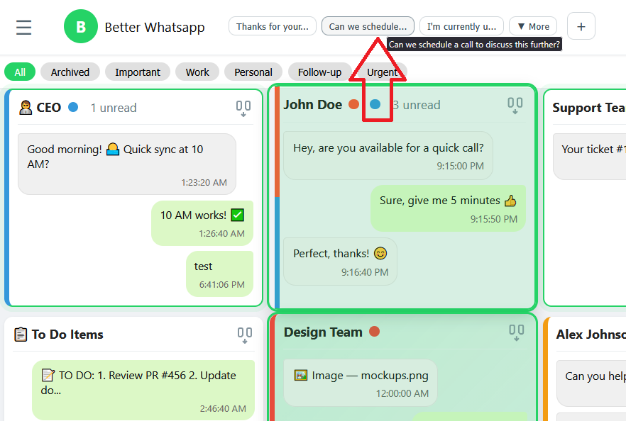
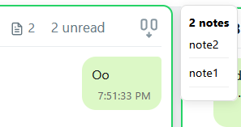
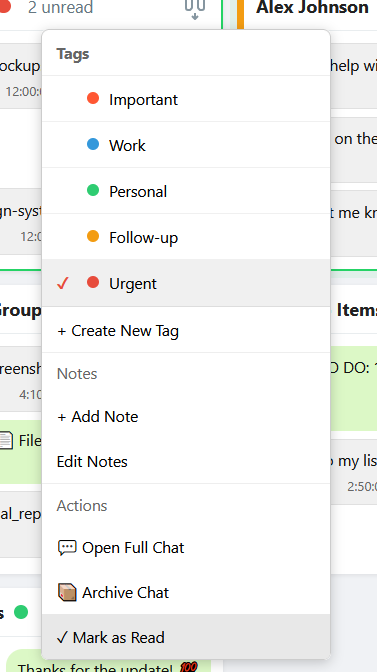
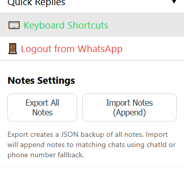

# Better Whatsapp Web

Simple local app to connect your WhatsApp by scanning a QR code, display recent messages in a grid, select a chat card (or click "Send to selected") to send a preset reply.

very benificial if you want to manage a lot of chats quickly, there arent many solutions to do this and most ways require you to have a meta bussiness account and whatsapp bussiness api, this uses a workaround to get us workinig on personal whatsapp accounts (see Risks And Important Features)

To DO: Create a branch with support for official whatsapp bussiness API (PRs welcome)
Requirements
- Node.js 16+ (LTS recommended)

  


- **Comprehensive Keyboard Shortcuts**: 26 keyboard shortcuts for power users to navigate, select, send messages, and manage chats entirely without a mouse.

### Keyboard Shortcuts
---
**Navigation**
- `↑ ↓ ← →` - Navigate between chats in grid layout
- `Space` - Add/remove focused chat from selection
- `Enter` - Open full chat modal
- `Escape` - Deselect all chats
- `Ctrl+A` - Select all visible chats

**Quick Replies**
- `Ctrl+1` through `Ctrl+9` - Send quick reply #1-9 to selected chats
- `Ctrl+0` - Create new quick reply

**Interface**
- `Ctrl+/` or `?` - Show keyboard shortcuts guide
- `Ctrl+H` - Toggle settings sidebar
- `Ctrl+T` - Create new tag
- `Ctrl+R` - Refresh chats
- `Ctrl+M` - Focus message input field
- `Ctrl+Shift+R` - Mark selected chats as read

**Modals**
- `Ctrl+Enter` - Save/confirm in tag/quick reply/note editors
- `Escape` - Cancel/close any modal
- `Enter` - Send message (in full chat modal)
- `Escape` - Close full chat modal
---

### Press `?` or `Ctrl+/` in the app to view the shortcuts guide anytime.


---
### Special Features
- Quick Replies (for multiple chats) CRUD: create, edit, delete, import from JSON, export to JSON.

- Multi-select send: select multiple chat cards and send a quick reply to all of them at once.
- Compact cards: each chat card shows last messages (up to 3) with WhatsApp-like bubbles for quick scanning.
- Sticker & media preview: stickers are shown inline in compact cards (small thumbnail) and full media (images/PDFs) render inside the full-chat modal.
- Tags (backup and restorable ): create colored tags, assign/unassign tags to chats via right-click context menu, filter the chat grid by tag, and import/export tags + assignments.
- Notes: add freeform notes bound to chats. Notes support create/read/update/delete, import/export, deduplication on import, and phone-number fallback mapping during import.
- Note badges & preview: chat cards show a compact notes badge (📝) when notes exist. Hovering a card for ~1.5s shows a floating preview bubble with up to 3 notes (scrollable if more).

> 
- Context menu: right-click a chat card to manage tags and notes quickly (`+ Add Note`, `Edit Notes`).

> 
- Central Notes settings: a `Notes ⚙` button in the header exposes a central Import/Export panel to backup or restore all notes.
> 
- Server-backed persistence: presets, tags, tag assignments, and notes are stored in `data.sqlite` via `sql.js` (WASM).


### Notes (details)
- Storage: notes are stored with both `chat_id` (e.g., `1234567890@c.us`) and a normalized `phone_number` when available. This helps reconnect notes if chats are deleted and later reappear.
- Import behavior: the import endpoint attempts to match incoming notes to existing chats by `chatId` first, then by `phoneNumber` (matching `tag_assignments.phone_number` or existing `notes.phone_number`), and finally by constructing `phone@c.us` as a fallback. Import has optional `replace` behavior (delete existing then insert).
- Deduplication: when importing, the server skips notes that already exist with identical `chat_id` and `text` (counts reported in the import response as `imported`, `skipped`, `failed`, `total`).

Install

```bash
cd c:/Users/Waths/Desktop/better-whatsapp
npm install
```

Run

```bash
npm start
# open http://localhost:3000 in your browser
```
tests (for developers)
```bash
npm run test-quick-replies # tests the quick reply functionality CRUD + DB export imports as json
```

How it works
- On first run the server will print and emit a QR code. Scan with WhatsApp "Linked devices" → "Link a device".
- After authentication the UI hides the QR and shows messages.
- Click a message square to select it. Type a preset reply in the input and press `r` or click "Send to selected" to send.

Notes & next steps
- This is a minimal demo. Improve by adding:
  - message pagination and search
  - mapping message to exact chat contact/name
  - confirmations and delivery status
  - authentication & access control for the web UI

### Why "Better WhatsApp"?
- Focused inbox: grid of chat cards so you can scan recent conversations quickly.
- Quick replies: create, edit, import/export, and send preset messages to single or multiple selected chats.
- Persistent server-side storage: quick replies are stored in a local SQLite file (`data.sqlite`) (implemented with `sql.js`) so presets survive restarts.
- Full-chat modal: open a chat to see a scrollable history (with inline images and PDF previews) and send messages from the modal.
- Pinning & unread prioritization: pin important chats and surface unread conversations.


### Risks & Important Notes
- This app uses the WhatsApp Web client (via `whatsapp-web.js`) and requires scanning your WhatsApp QR to link. The application acts like a browser session for your account.
- Security & privacy risks:
  - Anyone with access to your machine and the LocalAuth session files can access your WhatsApp session.
  - Media and messages may be downloaded and temporarily encoded as data URLs for preview; large files may increase disk and memory usage.
  - Keep `data.sqlite` and the `./.wwebjs_auth` session folder secure and backed up if needed.
- WhatsApp Terms of Service:
  - Using third-party tools to access WhatsApp Web may violate WhatsApp's Terms of Service in some circumstances. Use this project only for personal, legitimate use and at your own risk.

### Pros and Cons

- Pros:
  - Faster triage: grid + recency/unread sorting helps process messages quickly.
  - Reusable quick replies: saves typing and supports multiline replies.
  - Local-first: data and session stay on your machine (no central server required).
  - Lightweight persistence without native installs (`sql.js` avoids native builds).

- Cons / Limitations:
  - Not an official WhatsApp client — behavior depends on WhatsApp Web and `whatsapp-web.js` internals.
  - Media handling is basic: large files are encoded as data URLs; consider adding streaming or direct file links for heavy usage.
  - No user authentication for the web UI in this prototype — anyone who can reach the server can control the linked WhatsApp session.
  - Possible breakage: changes to WhatsApp Web can break the underlying library and require updates.

### Quick Start

Requirements
- Node.js (LTS recommended, >= 18 works well)

Install


Simple local app to connect your WhatsApp by scanning a QR code, display recent messages in a grid, select a chat card (or click "Send to selected") to send a preset reply.

This project is a personal productivity prototype — it helps triage many chats quickly without needing the official Business API.

To DO: Create a branch with support for official WhatsApp Business API (PRs welcome)

Requirements
- Node.js 16+ (LTS recommended; Node 18+ recommended for built-in fetch support in tests)

Install

```bash
cd c:/Users/Waths/Desktop/better-whatsapp
npm install
```

Run

```bash
npm start
# open http://localhost:3000 in your browser
```

Tests (for developers)
```bash
npm run test-quick-replies  # quick-replies API end-to-end
npm run test-tags          # tags API end-to-end
npm run test-notes         # notes API end-to-end (CRUD, import/export, dedupe)
```

How it works
- On first run the server will print and emit a QR code. Scan with WhatsApp "Linked devices" → "Link a device".
- After authentication the UI hides the QR and shows messages in a compact grid.
- Click a chat card to select it. Type a preset reply in the input and click "Send to selected".


### API Endpoints (useful ones)
- GET `/api/notes?chatId=...` — list notes for a chat.
- GET `/api/notes/export` — export all notes (or add `?chatId=...` to export just one chat).
- POST `/api/notes` — create a note: `{ chatId, text }`.
- PUT `/api/notes/:id` — update a note: `{ text }`.
- DELETE `/api/notes/:id` — delete a note.
- POST `/api/notes/import` — import notes: `{ notes: [...], replace: boolean }` (import will append by default if `replace: false`).
- GET `/api/notes/counts` — returns counts per chat for efficient badge rendering.

Tags API endpoints are also available (see server routes) and include `/api/tags`, `/api/tags/assign`, `/api/tags/import`, `/api/tags/export`.

### Testing
- Start the server and then run the provided test scripts which exercise the APIs end-to-end:

```powershell
npm run test-quick-replies
npm run test-tags
npm run test-notes
```

The notes test (`test/test_notes.js`) will:
- create, read, update, and delete notes via the API,
- test export and import (append) flows,
- verify deduplication on import,
- verify phone-number fallback import,
- and clean up after itself.

### Troubleshooting
- If the QR does not appear, check server logs for `qr` or initialization errors.
- If `sql.js` fails to load the WASM, ensure `node_modules/sql.js/dist/sql-wasm.wasm` exists.
- Tests use the global `fetch` API (available in Node 18+). If you run tests with older Node, install a fetch polyfill.

### Security Recommendations
- Run this app only on trusted machines.
- Protect the `./.wwebjs_auth` folder and `data.sqlite` file (don’t share them).
- If exposing this server beyond localhost, add authentication (not included in the prototype).

### Contributing
  - authentication for the web UI
  - paginated message loading and search
  - streaming media previews and thumbnails
  - per-chat pin persistence

use the dev-frontend server if you are only doing frontend stuff (no need for linking whatsapp almost all functionality should retain except for minor glithces)

```bash
npm run dev-frontend
```
this will load a sample frontend with mock-server.js as backend

### License & Disclaimer
- This is an independent project (MIT-style usage). It is not affiliated with WhatsApp/Facebook/Meta.
- Use responsibly and respect WhatsApp's Terms of Service.

````
